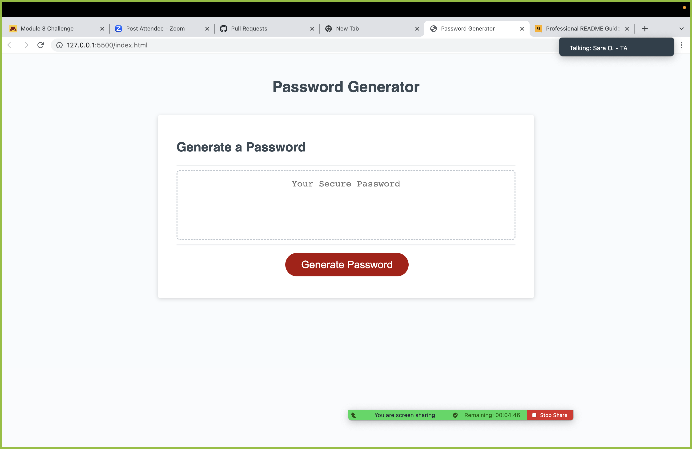

# Password Generator Starter Code

#

## Description
in this project i reconfigured a stater code given to meet its criteria . the criteria were to prompt the computer to give me  
a lowercase & uppercase letters, number and special characters.once teh user answwrs the prommpt on the screen .the webiste generates a random password meeting its criteria.

https://ashukri1.github.io/Password-Generator/;

Provide a short description explaining the what, why, and how of your project. Use the following questions as a guide:

- What motivated me was teh challenge this homework was about . i had to think and do alot of research on my own as i knew little about javascript.
-i built this porject to enhance my portfolio for future work refence and show employers my talent of work.
- i solved a website which had no interaction and gave it some prompt so the user can interact with the webpage and generate a random based on the criteria.
- how javascript gives functionality and interactivity . this with HTML & CSS is the behind the scenes of most webpages on the internet.

## Table of Contents (Optional)

If your README is long, add a table of contents to make it easy for users to find what they need.

- [Installation](#installation)
- [Usage](#usage)
- [Credits](#credits)
- [License](#license)

## Installation

What are the steps required to install your project? Provide a step-by-step description of how to get the development environment running.

## Usage

Provide instructions and examples for use. Include screenshots as needed.

To add a screenshot, create an `assets/images` folder in your repository and upload your screenshot to it. Then, using the relative filepath, add it to your README using the following syntax:

